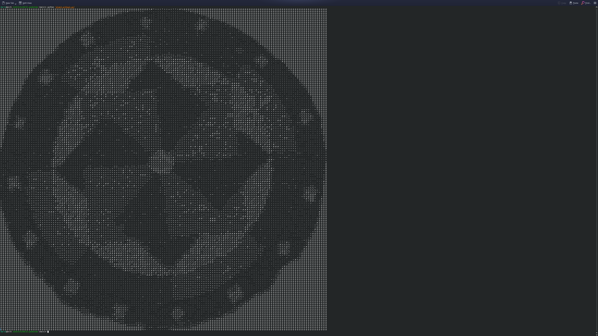

# 🌸 ASCII Pookalam

A festive **Onam Pookalam** made using only **10 characters**:

['@', '%', '#', '*', '+', '=', '-', ':', '.', '\n']

- **Total characters:** 22,348  
- **Format:** Plain text (UTF-8)  

## Preview

Open `pookalam.txt` in a monospace font editor (like VS Code or terminal) to see the full art.
